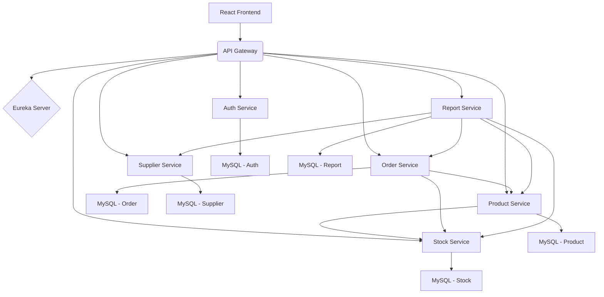

# 📦 Inventory Management System (Microservices Architecture)


---

## 📝 Table of Contents
- [About the Project](#-about-the-project)
- [Features](#-features)
- [Architecture](#-architecture)
- [Security Flow](#-security-flow)
- [Technologies Used](#-technologies-used)
- [Modules Overview](#-modules-overview)
- [Getting Started](#-getting-started)
  - [Prerequisites](#prerequisites)
  - [Backend Setup](#backend-setup)
  - [Frontend Setup](#frontend-setup)
- [Usage](#-usage)
- [Contributing](#-contributing)
- [License](#-license)
- [Contact](#-contact)

---

## 🌟 About the Project

The **Inventory Management System** is a distributed microservices-based application designed to manage products, orders, stock levels, and suppliers. It emphasizes clean architecture, inter-service communication, security, and modular design.

Developed collaboratively by a team of five, each managing different services, this project showcases real-world scalable software architecture. The **Order Service** was my primary contribution.

---

## ✨ Features

- **Authentication & Authorization** using JWT
- **Product Management** with CRUD operations and real-time stock status
- **Order Management** including status updates and cancellation rules
- **Stock Handling** with real-time tracking and reorder notifications
- **Supplier Management** (CRUD)
- **Reporting Module** with filters (orders, inventory, suppliers)
- **User Profile Management**

---

## 🏗️ Architecture

This system follows a robust Microservices pattern:



# Key Architectural Components:

  * **React Frontend**: User Interface for interacting with the system.

  * **API Gateway (Spring Cloud Gateway)**: Single entry point for all client requests, handling routing, load balancing, centralized JWT validation, and CORS management.

  * **Service Discovery (Eureka Server)**: Central registry for microservices to register themselves and discover others dynamically.

  * ## **Microservices:**
    * **Authentication Service**: Manages user registration, login, and profiles.
    * **Product Service**: Manages product catalog details (name, description, price, images).
    * **Order Service**: (My Primary Responsibility) Handles the creation, management, and status updates of customer orders, interacting with Product and Stock services.
    * **Stock Service**: Tracks and manages inventory levels for products.
    * **Supplier Service**: Manages supplier information.
    * **Report Service**: Generates various analytical reports based on data from other services.

  * **Databases**: Each microservice maintains its own MySQL database schema for data independence.
---
## 🔒 Security Flow
Our security implementation is stateless and robust, primarily leveraging JWTs and centralized control at the API Gateway:

### 1. User Registration (Initial Setup):
1. User signs up via React frontend.
2. Request to Auth Service (via Gateway).
3. Auth Service uses Spring Security to hash password (BCrypt) and store user credentials, validating uniqueness of email/username.

### 2. User Login (Obtaining a Token):
1. User logs in via React frontend.
2. Request to Auth Service (via Gateway).
3. Auth Service authenticates credentials using Spring Security.
4. Upon successful authentication, a JWT is generated and returned to the frontend. This token represents the user's authenticated session.

### 3. Authenticated Requests (Accessing Protected Resources):
1. For any subsequent requests to protected resources, the React frontend attaches the received JWT in the `Authorization: Bearer <token>` header.
2. All such requests first arrive at the API Gateway.
3. The API Gateway's `JwtAuthFilter` (a custom `GlobalFilter`) intercepts these requests. It performs a rapid validation of the JWT's signature and expiration.
4. If the token is valid, the request is routed to the appropriate microservice. If the token is invalid or missing, the gateway immediately rejects the request with a `401 Unauthorized` status. This acts as a centralized, efficient security perimeter.
5. The API Gateway also centrally handles CORS (Cross-Origin Resource Sharing), ensuring smooth cross-origin communication with the React frontend.
6. Individual microservices then trust that requests reaching them have already been authenticated by the gateway. They can extract user information (claims) from the JWT for granular authorization checks if required.

### 4. Logout:
The frontend simply discards the stored JWT. As authentication is stateless, no server-side session invalidation is needed.

---
## 🛠️ Technologies Used

### Frontend
- **React.js**: A JavaScript library for building user interfaces.
- **React Router**: For navigation and routing.
- **Axios**: For making HTTP requests to the backend.
- **Tailwind CSS / Bootstrap / Custom CSS**: (Specify if you used any UI framework/library) For styling and responsive design.

### Backend (Java / Spring Boot)
- **Java 17+**: Programming language.
- **Spring Boot 3.x**: Framework for building standalone, production-grade Spring applications.
- **Spring Cloud**:
  - **Spring Cloud Gateway**: API Gateway.
  - **Spring Cloud Netflix Eureka**: Service Discovery.
  - **Spring Cloud OpenFeign**: Declarative REST client for inter-service communication.
- **Spring Data JPA**: For database interaction.
- **MySQL**: Relational database.
- **Lombok**: Boilerplate code reduction library.
- **JWT (jjwt library)**: JSON Web Token implementation for security.
- **BCrypt**: For password hashing.
- **Maven**: Build automation tool.
- **SLF4j + Logback**: For logging.

---
## 📦 Modules Overview
This project is divided into the following independent microservices:

- `eureka-server`: The central discovery service for all microservices.
- `api-gateway`: The entry point for all client requests, handling routing, security, and CORS.
- `auth-service`: Manages user authentication (registration, login) and user profiles.
- `product-service`: Manages product data (details, images, association with stock).
- `order-service`: (My Primary Contribution) Handles the creation, management, and status updates of customer orders, interacting with Product and Stock services.
- `stock-service`: Manages and tracks inventory levels for products.
- `supplier-service`: Manages supplier information (details, contact).
- `report-service`: Generates various analytical reports based on data from other services.
---
## 🚀 Getting Started
To get a local copy up and running, follow these simple steps.

### Prerequisites
- **Java Development Kit (JDK) 17 or higher**
- **Maven 3.6+**
- **Node.js & npm (or Yarn) (for frontend)**
- **MySQL Database: A running MySQL instance.**
- **Git**

### Backend Setup
1. **Clone the repository:**
    ```bash
    git clone https://github.com/syed-masood-pro/Inventrory-Management-System.git
    cd Inventrory-Management-System
    ```

2. **Database Configuration:**
    - Create separate MySQL databases for each service (e.g., auth_db, product_db, order_db, stock_db, supplier_db, report_db).
    - Update the `src/main/resources/application.properties` (or `application.yml`) file in each microservice directory to point to your MySQL database:
    ```properties
    spring.datasource.url=jdbc:mysql://localhost:3306/[your_db_name]?useSSL=false&serverTimezone=UTC
    spring.datasource.username=[your_mysql_username]
    spring.datasource.password=[your_mysql_password]
    spring.jpa.hibernate.ddl-auto=update # or create, for first run
    spring.jpa.show-sql=true
    ```

3. **JWT Secret:**
    - In `auth-service` and `api-gateway`, ensure you set a consistent JWT secret key. You can add it to `application.properties`:
    ```properties
    jwt.secret=<YOUR_SECURE_JWT_SECRET_KEY> # Must be the same in auth-service and api-gateway
    ```
    - Replace `<YOUR_SECURE_JWT_SECRET_KEY>` with a long, strong, random string.

4. **Build All Microservices:**
    - Navigate to the root directory of the cloned repository.
    - Build all projects using Maven:
    ```bash
    mvn clean install
    ```

5. **Run Microservices (Order of Execution Matters):**
    - It's crucial to start the services in the following order:
        - **Eureka Server:**
        ```bash
        cd eureka-server
        mvn spring-boot:run
        ```
        - (Wait for it to start, usually on `http://localhost:8761`)
        - **All other Microservices (Auth, Product, Order, Stock, Supplier, Report):** You can open separate terminal windows for each.
        ```bash
        cd auth-service
        mvn spring-boot:run
        # --- In a new terminal ---
        cd product-service
        mvn spring-boot:run
        # --- In a new terminal ---
        cd order-service
        mvn spring-boot:run
        # --- Repeat for stock-service, supplier-service, report-service ---
        ```
        - **API Gateway:** (Start this last, after all other services have registered with Eureka)
        ```bash
        cd api-gateway
        mvn spring-boot:run
        ```
        - (Usually on `http://localhost:8080`)

### Frontend Setup
1. **Navigate to the frontend directory:**
    ```bash
    cd frontend # Assuming your React project is in a 'frontend' folder
    ```

2. **Install dependencies:**
    ```bash
    npm install
    # OR
    yarn install
    ```

3. **Configure API base URL:**
    - Ensure your React app is configured to communicate with the API Gateway (default `http://localhost:8080`). This is typically done in an `.env` file or a configuration file.
    ```properties
    # .env file in React project root
    REACT_APP_API_BASE_URL=http://localhost:8080/api
    ```

4. **Start the React development server:**
    ```bash
    npm start
    # OR
    yarn start
    ```
    - (The frontend should open in your browser, usually on `http://localhost:3000`)
---
## 💡 Usage
Once all services and the frontend are running:

- **Register:** Navigate to the registration page (`http://localhost:3000/register` or similar, depending on your React routes) and create a new user account.
- **Login:** Use the newly created credentials to log in. Upon successful login, you will be redirected to the main dashboard.
- **Explore:**
    - Navigate to the Products section to view, add, update, or delete products. Adding a product will automatically manage its initial stock via the Stock Service.
    - Go to the Orders section to place new orders (which will interact with Product and Stock services) and manage existing order statuses.
    - Manage your suppliers in the Suppliers section.
    - Generate various analytical reports in the Reports section, applying different filters.
    - Update your user profile in the Profile section.
---
## 🤝 Contributing
Contributions are what make the open-source community such an amazing place to learn, inspire, and create. Any contributions you make are greatly appreciated.

If you have a suggestion that would make this better, please fork the repo and create a pull request. You can also simply open an issue with the tag "enhancement".
Don't forget to give the project a star! ⭐

1. Fork the Project
2. Create your Feature Branch (`git checkout -b feature/AmazingFeature`)
3. Commit your Changes (`git commit -m 'Add some AmazingFeature'`)
4. Push to the Branch (`git push origin feature/AmazingFeature`)
5. Open a Pull Request
---
## 📄 License
Distributed under the MIT License. See `LICENSE` for more information.
---
## 📧 Contact
Syed Masood - syedmasood.pro@gmail.com

Project Link: [https://github.com/syed-masood-pro/Inventrory-Management-System/](https://github.com/syed-masood-pro/Inventrory-Management-System/)


